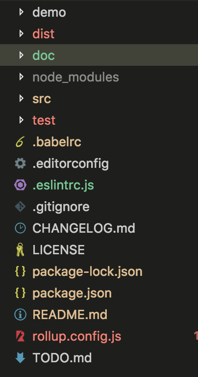
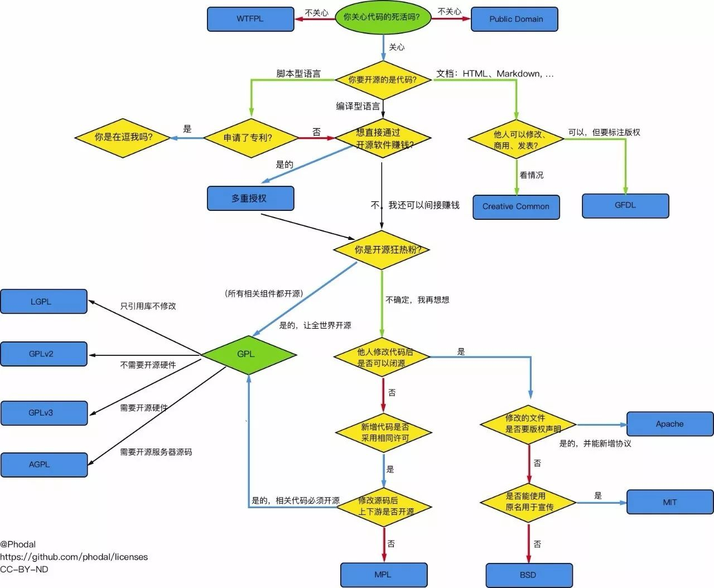

# 如何写一个现代的javascript库

帮助大家能够快速学习，如何搭建一个标准的javascript库，创建一个开源库都需要哪些东西等

至于做个什么样的开源项目，你自己玩吧！！！，推荐[这里](http://blog.jobbole.com/113602/)积累下经验吧

标准的javascript库都包含哪些东西
- 文档
- 测试用例
- demo
- 自动化构建，发布等
- 规范

## 第一步 文档

标准的项目文档应该包含如下

- README.md
- TODO.md
- CHANGELOG.md
- LICENSE
- doc



### README.md

`README.md`README是一个项目的门面，应该简单明了的呈现用户最关心的问题，一个开源库的用户包括`使用者`和`贡献者`，所以一个文档应该包括`项目简介`，`使用者指南`，`贡献者指南`，`代码组织架构`等几个部分，

如果你的`README`包括上面的内容,那么当使用者拿到代码,打开`README`后,基本就知道该如何下手了

美观也是必不可少的，下面介绍下徽章，[如何制作徽章](https://shields.io/#/)，常用的徽标主要有持续集成状态、项目版本信息、代码测试覆盖率、项目支持平台、项目语言、代码分析等，[参考](https://juejin.im/post/5a32157c6fb9a0450b6667ac)

### TODO.md

`TODO`应该记录项目的计划，这对于贡献者和使用者都有很重要的意义，下面是TODO的例子
```
- [x] 功能一
- [ ] 功能二
```
### CHANGELOG.md
`CHANGELOG.md`记录项目的变更日志，每次升级发布的时候，都要记录项目的版本，发布时间，变更内容等

### LICENSE
开源项目必须要选择一个协议，因为没有协议的项目是没有人敢使用的，[参考这里](https://spdx.org/licenses/)，如何选择正确的正确的开源许可？[参考这里](https://blog.csdn.net/j01g58uc80251/article/details/78131010)，建议是选择MIT和BSD协议



### DOC
详细的使用文档，一份详细的文档应该：
- 功能的详细介绍
- 使用方法的详细介绍
- 代码用例
- 特殊说明等

## 第二步 构建工程
一个工程的构建过程包括编译，打包，压缩，测试等一切对源码进行的相关处理

### 编译
理想情况下，开发者开心的写es6+的代码，然后能够运行在node和浏览器端，兼容用户的AMD和CMD模块方案，用户能顺利应用起来。理想是个好东西，但是如何才能使开发者和用户都能开心呢？这里我使用的是`babel v7`，我选择的是最新的现代化的`@babel/preset-env`
```bash
$ npm install @babel/preset-env -D
```
然后在根目录下新建一个`.babelrc`文件，添加配置
```js
{
  "presets": [
    [
      "@babel/env",
      {
        "modules": false,
        "targets": {
          "browsers": "last 2 versions, > 1%, Android >= 4.1, IOS >= 9,  Chrome >= 16",
          "node": "6.14.0"
        }
      }
    ]
  ]
}
```
babel的配置可以[参考这里](https://babeljs.io/docs/en/babel-preset-env#install)，babel最新版`@babel/preset-env`可以使开发者，用最新的js语法特性，而且无需关心对用户环境做转换（比如引入 browser polyfills），

### 打包
编译解决了ES6到ES5的问题，打包可以把多个文件合并成一个文件，对外提供统一的文件入口，打包解决的是依赖引入的问题。当下比较流行的打包编译工具有gulp，rollup，webpack等。如何选择呢？推荐两个比较流行的`rollup`和`webpack`，二者主要区别： 纯js库使用`rollup`，其他场景使用`webpack`, rollup打包后，没有很多冗杂的代码，然而webpack有，[rollup文档](https://www.rollupjs.com/guide/zh#babel)，[webpack文档](https://www.webpackjs.com/)，下面是介绍下rollup

#### [rollup介绍](https://www.rollupjs.com/guide/zh#babel)
作为下一代打包利器，通过Tree-shacking的方式来剔除各模块中最终未被引用到的方法，通过仅保留被调用到的代码块来缩减打包文件的大小

#### 使用方式
```bash
$ npm install rollup -D 
```

打包方式简单粗暴，直接`rollup src/main.js -o dist/bundle.js -f cjs`（装了全局的rollup才可以用`rollup`命令😯），就可以打包了。和 webpack 一样，rollup 也支持通过配置文件来实现更灵活的功能

```js
import babel from 'rollup-plugin-babel'

import {name, banner} from './rollup'

export default {
  input: 'src/index.js', // 入口文件
  output: {
    file: 'dist/index.js', // 输出的文件 (如果没有这个参数，则直接输出到控制台)
    format: 'cjs', // 输出的文件类型 (amd, cjs, es, iife, umd)
    banner, // 打包后代码的注释头
    name, // 生成UMD模块的名字
  },
  plugins: [ // 插件
    babel({
      runtimeHelpers: true,
      exclude: 'node_modules/**',
    }),
  ],
}
```

然后执行
```
$ rollup -c
```
即可通过默认配置文件（rollup.config.js）所设置的信息来进行打包。也可以
```
$ rollup -c xxxx/xxx.js
```
选择指定配置文件打包

## 第三步 规范
无规矩啥也不成，特别是开源的项目，会有其他贡献者参与，长时间一起dan疼

### 编辑器规范
首先可以通过`.editorconfig`来保证缩进、换行的一致性，等等如下所示，其他[参考这里](https://editorconfig.org/)
```js
root = true

[{*.js,*.css,*.html}]
indent_style = space
indent_size = 2
end_of_line = lf
charset = utf-8
insert_final_newline = true

[{package.json,.*rc,*.yml}]
indent_style = space
indent_size = 2

```